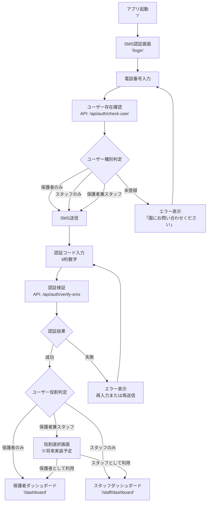

# 画面遷移図 - 保育園保護者向けモバイルアプリ

## 概要
このドキュメントは、保育園保護者向けモバイルアプリの画面遷移図を示します。
多役割認証システム（保護者・スタッフ・保護者兼スタッフ）に対応した画面フローを詳細に記述しています。

## 1. 全体システム構成

### 認証システム構成
- **SMS認証**: Media4U SMS APIを使用した多要素認証
- **多役割対応**: 保護者/スタッフ/保護者兼スタッフの3パターン
- **JWT認証**: アクセストークン(1時間) + リフレッシュトークン(7日間)

### 画面構成
- **認証画面**: 共通SMS認証フロー
- **保護者用画面**: 8画面（ダッシュボード + 7主要機能画面）
- **スタッフ用画面**: 8画面 + 管理機能

## 2. 認証フロー (共通)



## 3. 保護者用画面遷移図

```mermaid
graph TD
    A[保護者ダッシュボード<br/>'/dashboard'] --> B[家族登録<br/>'/family/invite']
    A --> C[写真ギャラリー<br/>'/photos']
    A --> D[園内レポート受信<br/>'/reports']
    A --> E[お知らせ一覧<br/>'/announcements']
    A --> F[カレンダー<br/>'/calendar']
    A --> G[園児一覧<br/>'/children']
    A --> H[通知設定<br/>'/settings/notifications']
    A --> I[カスタマイズ設定<br/>'/settings/customization']

    B --> B1[家族一覧タブ]
    B --> B2[家族登録タブ]
    B2 --> B3[登録フォーム]
    B3 --> B4[SMS送信確認]
    B4 --> B1

    C --> C1[写真グリッド表示]
    C --> C2[写真リスト表示]
    C1 --> C3[写真詳細モーダル]
    C2 --> C3
    C3 --> C4[写真ダウンロード]

    D --> D1[レポート一覧]
    D1 --> D2[レポート詳細表示]
    D2 --> D3[確認ボタン]
    D2 --> D4[返信フォーム]
    D3 --> D1
    D4 --> D1

    E --> E1[保育園タブ🏫]
    E --> E2[システムタブ⚙️]
    E1 --> E3[お知らせ詳細ダイアログ]
    E2 --> E3

    F --> F1[週表示]
    F --> F2[月表示]
    F1 --> F3[イベント詳細モーダル]
    F2 --> F3

    G --> G1[園児一覧表示]
    G1 --> G2[園児選択]
    G2 --> G3[連絡フォーム<br/>欠席・遅刻・お迎え]
    G1 --> G4[連絡履歴]
    G3 --> G5[送信確認画面]
    G5 --> G1

    G3 --> G6[欠席連絡フォーム]
    G3 --> G7[遅刻連絡フォーム]
    G3 --> G8[お迎え連絡フォーム]
    G6 --> G5
    G7 --> G5
    G8 --> G5

    H --> H1[プッシュ通知設定]
    H --> H2[レポート通知設定]
    H --> H3[連絡確認通知設定]
    H --> H4[イベント通知設定]
    H --> H5[お知らせ通知設定]

    I --> I1[フォント設定タブ]
    I --> I2[言語設定タブ]
    I --> I3[通知設定タブ]
    I1 --> I4[フォントサイズ選択<br/>小/中/大/特大]
    I2 --> I5[言語選択<br/>日本語/英語/中国語/韓国語]
    I3 --> I6[プッシュ通知ON/OFF]
    I3 --> I7[レポート通知ON/OFF]
    I3 --> I8[連絡確認通知ON/OFF]
    I3 --> I9[イベント通知ON/OFF]
    I3 --> I10[お知らせ通知ON/OFF]

    %% 戻るナビゲーション
    B --> A
    C --> A
    D --> A
    E --> A
    F --> A
    G --> A
    H --> A
    I --> A
```



## 4. スタッフ用画面遷移図

```mermaid
graph TD
    A[スタッフダッシュボード<br/>'/staff/dashboard'] --> B[連絡受信・確認<br/>'/staff/contacts']
    A --> C[レポート管理<br/>'/staff/reports']
    A --> D[写真一覧<br/>'/staff/photos']
    A --> F[お知らせ管理<br/>'/staff/announcements']
    A --> G[スタッフ統合アプリ<br/>'/staff']
    A --> H[カレンダー<br/>'/staff/calendar']

    A --> Z[ログアウト<br/>→ 認証画面へ]

    B --> B1[欠席連絡一覧]
    B --> B2[遅刻連絡一覧]
    B --> B3[お迎え連絡一覧]
    B1 --> B4[連絡詳細表示]
    B2 --> B4
    B3 --> B4
    B4 --> B5[確認ボタン]
    B5 --> B1

    C --> C1[レポート一覧表示<br/>ステータスフィルター: 全て/下書き/公開済み]
    C --> C2[新規作成ボタン]
    C2 --> C3[レポート作成画面<br/>'/staff/reports/create']
    C1 --> C4[レポートカードタップ]
    C4 --> C5[レポート編集画面<br/>'/staff/reports/edit/:id']

    C3 --> C6[園児選択]
    C3 --> C7[レポート種別選択<br/>活動🎨/食事🍽️/睡眠😴/ケガ🩹/事故⚠️/喧嘩😤]
    C3 --> C8[内容入力]
    C3 --> C9[写真添付(任意)]
    C3 --> C10{保存種別選択}
    C10 -->|下書き保存| C11[下書きとして保存<br/>status: draft]
    C10 -->|公開| C12[公開として保存<br/>status: published]
    C11 --> C1
    C12 --> C1

    C5 --> C13[既存データ表示]
    C5 --> C14[内容編集<br/>※公開済みも編集可能]
    C5 --> C15{編集後の保存}
    C15 -->|下書きとして保存| C16[下書き更新]
    C15 -->|公開| C17[公開に変更/更新]
    C15 -->|削除| C18{ステータス確認}
    C18 -->|下書き| C19[削除確認ダイアログ]
    C18 -->|公開済み| C20[削除不可メッセージ]
    C19 -->|確認| C21[レポート削除]
    C19 -->|キャンセル| C5
    C21 --> C1
    C16 --> C1
    C17 --> C1
    C20 --> C5

    D --> D1[写真一覧表示]
    D --> D2[写真検索・フィルタ]
    D --> D6[アップロードボタン]
    D6 --> E[写真アップロード<br/>'/staff/photos/upload']
    D1 --> D3[写真詳細表示]
    D3 --> D4[写真編集]
    D3 --> D5[写真削除]
    D4 --> D1
    D5 --> D1

    E --> E1[写真選択<br/>ドラッグ&ドロップ/ファイル選択]
    E --> E2[活動タグ設定]
    E --> E3[園児選択(複数可)]
    E --> E4[説明文入力]
    E --> E5[公開範囲設定<br/>クラス/学年/学校]
    E --> E6[公開日時設定]
    E --> E7[アップロード実行]
    E7 --> E8[進捗表示]
    E8 --> D

    F --> F1[お知らせ一覧表示<br/>ステータスフィルター: 全て/下書き/公開済み/アーカイブ]
    F --> F2[新規作成ボタン]
    F2 --> F3[お知らせ作成画面<br/>'/staff/announcements/create']
    F1 --> F4[お知らせカードタップ]
    F4 --> F5[お知らせ編集画面<br/>'/staff/announcements/edit/:id']

    F3 --> F6[タイトル入力]
    F3 --> F7[カテゴリ選択<br/>一般/緊急/イベント/健康/献立/持ち物/その他]
    F3 --> F8[対象範囲設定<br/>全体/クラス単位/個別]
    F3 --> F9[本文入力<br/>マークダウン対応]
    F3 --> F10[添付ファイル(任意)<br/>画像・PDF、最大5個]
    F3 --> F11[重要度設定<br/>通常/重要/緊急]
    F3 --> F12{保存種別選択}
    F12 -->|下書き保存| F13[下書きとして保存<br/>status: draft]
    F12 -->|公開| F14[公開として保存<br/>status: published]
    F13 --> F1
    F14 --> F1

    F5 --> F15[既存データ表示]
    F5 --> F16[内容編集<br/>※公開済みも編集可能]
    F5 --> F17{編集後の保存}
    F17 -->|下書きとして保存| F18[下書き更新]
    F17 -->|公開| F19[公開に変更/更新]
    F17 -->|削除| F20{ステータス確認}
    F20 -->|下書き| F21[削除確認ダイアログ]
    F20 -->|公開済み・アーカイブ| F22[削除不可メッセージ]
    F21 -->|確認| F23[お知らせ削除]
    F21 -->|キャンセル| F5
    F23 --> F1
    F18 --> F1
    F19 --> F1
    F22 --> F5

    G --> G1[統合ダッシュボード]
    G1 --> G2[機能選択メニュー]
    G2 --> B
    G2 --> C
    G2 --> D
    G2 --> E
    G2 --> F
    G2 --> H

    H --> H1[週表示]
    H --> H2[月表示]
    H --> H3[カテゴリフィルター<br/>全体お知らせ/全体行事/学年活動/クラス活動/園休日]
    H1 --> H4[イベント詳細モーダル]
    H2 --> H4
    H3 --> H1
    H3 --> H2
    H4 --> H5[権限チェック<br/>受け持ちクラス・学年のみ表示]

    %% 戻るナビゲーション
    B --> A
    C --> A
    D --> A
    E --> D
    F --> A
    G --> A
    H --> A
```

## 5. 主要画面の詳細仕様

### 5.1 認証画面 ('/login')
- **電話番号入力**: 日本の携帯電話番号（070/080/090）11桁
- **SMS認証コード**: 6桁数字、5分間有効
- **エラーハンドリング**: 未登録ユーザー、認証失敗、制限回数超過
- **セキュリティ**: BCrypt暗号化、レート制限（SMS 1日3回、認証試行 5分間3回）

### 5.2 保護者ダッシュボード ('/dashboard')
- **統計情報**: 未読レポート数、未確認連絡数、新着写真数
- **クイックアクション**: 園児一覧（連絡機能）、写真閲覧、カレンダー確認
- **最新情報**: 最新レポート3件、今日のイベント、重要なお知らせ
- **ナビゲーション**: 全機能へのアクセスボタン

### 5.3 スタッフダッシュボード ('/staff/dashboard')
- **今日の状況**: 出席状況、未確認連絡数、未処理タスク数
- **クイックアクション**: レポート管理、写真アップロード、お知らせ管理、連絡確認
- **最近の活動**: 最新の連絡、レポート作成履歴、写真アップロード状況
- **統計情報**: 週間サマリー、月間レポート数、保護者エンゲージメント
- **ナビゲーション**: カレンダー、写真管理、お知らせ管理などの全機能へのアクセス

### 5.4 スタッフカレンダー ('/staff/calendar')
**注**: スタッフ用カレンダーは保護者用カレンダーと同じUI・機能を使用します。

- **共通UI**: 保護者用カレンダーコンポーネントを再利用
- **共通機能**: 週表示・月表示切り替え、カテゴリフィルター、イベント詳細モーダル、クイックナビゲーション
- **唯一の違い**: サーバーサイドでの権限ベースイベントフィルタリング
  - 全体お知らせ・全体行事・園休日: すべてのスタッフに表示
  - 学年活動: 受け持ち学年のみ表示
  - クラス活動: 受け持ちクラスのみ表示
- **実装**: APIエンドポイント (`/staff/calendar/{year}/{month}`) のみ異なり、レスポンス形式は保護者用と同一

## 6. ナビゲーション仕様

### 6.1 戻るボタン
- **配置**: 各画面のヘッダー左上
- **デザイン**: 「← 戻る」テキスト + アイコン
- **動作**: 前画面に戻る（履歴スタック使用）

### 6.2 ボトムナビゲーション（保護者用）
- **ホーム**: ダッシュボード
- **園児**: 園児一覧（連絡機能含む）
- **レポート**: 園内レポート受信
- **写真**: 写真ギャラリー
- **設定**: 通知設定・カスタマイズ

### 6.3 サイドメニュー（スタッフ用）
- **ダッシュボード**: 統計・概要
- **連絡管理**: 連絡受信・確認
- **レポート管理**: レポート一覧・作成・編集
- **写真**: 写真管理・アップロード
- **お知らせ管理**: お知らせ一覧・作成・編集

## 7. エラーハンドリング

### 7.1 認証エラー
- **未登録電話番号**: 「この電話番号は登録されていません。園にお問い合わせください。」
- **認証コード間違い**: 「認証コードが正しくありません。」
- **認証コード期限切れ**: 「認証コードの有効期限が切れています。新しいコードを取得してください。」
- **SMS送信制限**: 「本日のSMS送信回数の上限に達しました。明日再試行してください。」

### 7.2 ネットワークエラー
- **接続エラー**: 自動リトライ機能、オフライン時の操作継続
- **サーバーエラー**: エラーメッセージ表示、サポート連絡先案内
- **タイムアウト**: 操作継続可能な場合の処理方法案内

### 7.3 404エラー
- **存在しないページ**: カスタム404ページ、ホーム画面への誘導

## 8. レスポンシブデザイン

### 8.1 対応デバイス
- **スマートフォン**: 主要ターゲット（iPhone 12 Pro等）
- **タブレット**: iPad対応
- **デスクトップ**: 管理者用途

### 8.2 ブレークポイント
- **モバイル**: ~768px
- **タブレット**: 768px~1024px
- **デスクトップ**: 1024px~

## 9. アクセシビリティ

### 9.1 WCAG 2.1 AA準拠
- **キーボードナビゲーション**: 全機能をキーボードで操作可能
- **スクリーンリーダー対応**: 適切なARIA属性設定
- **カラーコントラスト**: WCAG基準クリア
- **フォントサイズ**: ユーザー設定による4段階調整

### 9.2 操作支援
- **音声読み上げ**: 重要な操作のガイダンス
- **振動フィードバック**: 操作完了の触覚フィードバック
- **大きなタッチターゲット**: 44px以上の推奨サイズ

## 10. パフォーマンス

### 10.1 読み込み時間
- **初回読み込み**: 3秒以内
- **画面遷移**: 1秒以内
- **API応答**: 500ms以内

### 10.2 オフライン対応
- **Service Worker**: キャッシュ戦略による高速表示
- **オフライン機能**: 重要な操作の継続実行
- **同期機能**: ネットワーク復旧時の自動同期

---

## 11. 変更履歴

### v1.1 (2025年10月9日)
- **お知らせ管理機能の追加**: スタッフダッシュボードからお知らせ一覧・作成・編集機能を追加
- **レポート管理の修正**: レポート編集画面で公開済みレポートも編集可能に変更
- **画面遷移フローの更新**: お知らせ管理のフロー詳細化、レポート管理のフロー修正

### v1.0 (2025年9月30日)
- 初版リリース

---

**更新日**: 2025年10月9日
**バージョン**: 1.1
**作成者**: Claude Code Development Team